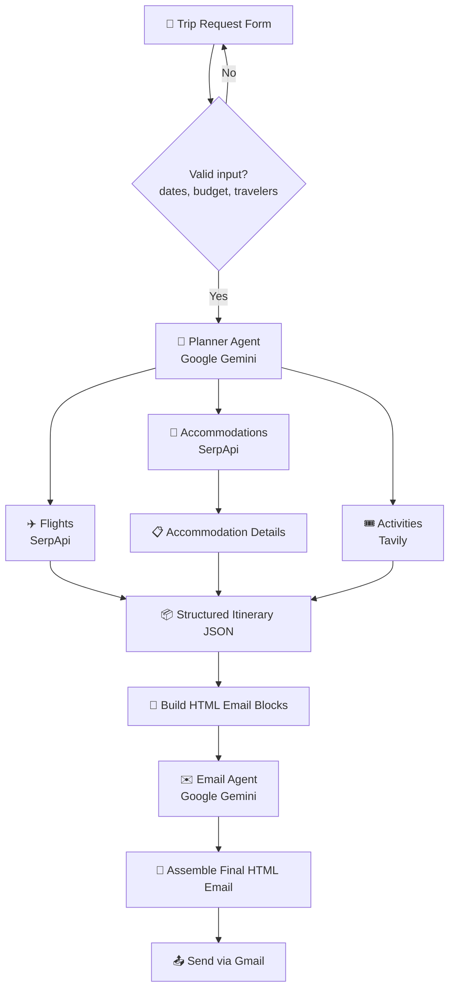

# ✈️ Automated AI Travel Plan Creator

An AI-powered, multi-agent trip planning workflow built with **n8n**. A user fills out a simple trip request form, and the workflow automatically searches real flights, hotels, and activities, builds a complete budget-aware day-by-day itinerary, and emails it as a beautifully formatted HTML report — fully automated, end to end.

## ✨ Features

- 📝 **Simple intake form** — collects departure city, destination, travel dates, number of travelers, accommodation type, budget, dietary preference, and travel group type
- ✅ **Input validation** — checks dates, budget, and traveler count before any AI or API calls are made
- 🤖 **AI Planner Agent** — a LangChain agent (powered by Google Gemini) that searches and reasons across four live tools:
  - **Flights** — real-time flight search via SerpApi (Google Flights)
  - **Accommodations** — hotel search via SerpApi (Google Hotels), with a follow-up **Accommodation Details** lookup for verified pricing, images, and booking links
  - **Activities** — destination activity discovery via Tavily search
- 💰 **Budget-aware planning** — the agent sums estimated costs and swaps in cheaper options if the total exceeds the user's budget
- 🍽️ **Dietary & group-aware recommendations** — respects dietary restrictions and adjusts suggestions for solo/couple/family/friends travel
- 📧 **Automated HTML email delivery** — a second AI agent (Email Agent) writes a personalized subject line and intro, and a code node assembles a fully responsive HTML email (flights, hotels, day-by-day itinerary, activity gallery, and cost summary) sent automatically via Gmail

## 🧠 How it works

## 🛠️ Tech stack

| Component | Tool / Service |
|---|---|
| Automation platform | [n8n](https://n8n.io) |
| Form intake | n8n Form Trigger |
| AI reasoning | Google Gemini (via LangChain agent nodes) |
| Flight & hotel search | [SerpApi](https://serpapi.com) (Google Flights / Google Hotels) |
| Activity search | [Tavily](https://tavily.com) |
| Email delivery | Gmail (OAuth2) |

## 🚀 Setup

1. **Import the workflow**
   - Download [`Automated_AI_Travel_Plan_Creator.json`](./Automated_AI_Travel_Plan_Creator.json) from this repo
   - In n8n: **Workflows → Add workflow → Import from File** → select the downloaded JSON

2. **Connect your credentials**
   This workflow needs API credentials for:
   - **Google Gemini** (PaLM API) — for both AI agents
   - **SerpApi** — for flight and hotel search
   - **Tavily** — for activity search
   - **Gmail (OAuth2)** — for sending the final itinerary email

   Add each under **n8n → Credentials**, then reassign them on the corresponding nodes if names don't auto-match.

3. **Activate the workflow**
   Toggle the workflow to **Active**, then open the form trigger's production URL to test it end to end.

## 📋 Example input

| Field | Example |
|---|---|
| Departure City | Delhi |
| Destination | New York |
| Start / End date | 2026-07-24 → 2026-08-18 |
| Travelers | 2 |
| Accommodation preference | Hotel |
| Budget | ₹200,000 |
| Dietary preference | No Restriction |
| Travel group | Couple |

The user then receives a full itinerary — flights, hotel options, a day-by-day plan, and a cost breakdown — directly in their inbox.

## ⚠️ Notes

- No credentials, API keys, or personal data are included in this repository — you'll need your own SerpApi, Tavily, Google Gemini, and Gmail credentials.
- This workflow **searches and recommends only** — it does not book or pay for anything.

## 📄 License

This project is licensed under the [MIT License](./LICENSE) — feel free to fork and adapt it for your own use.
